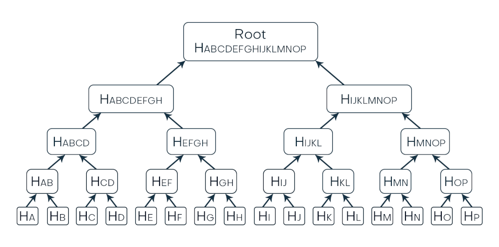
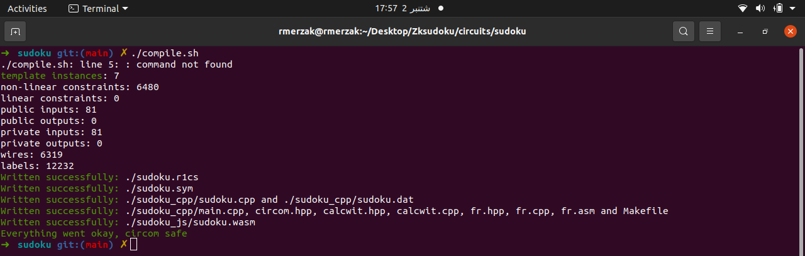
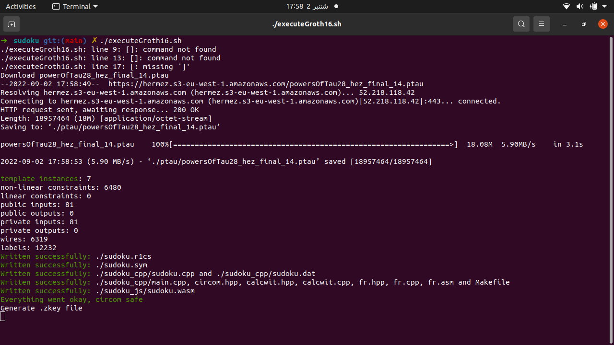
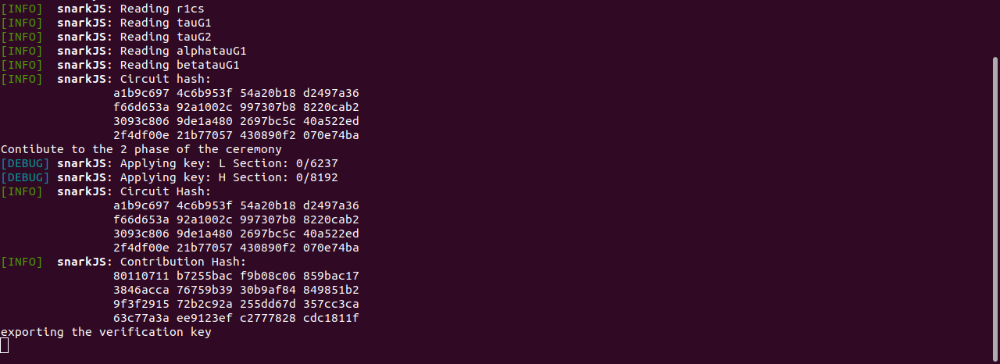
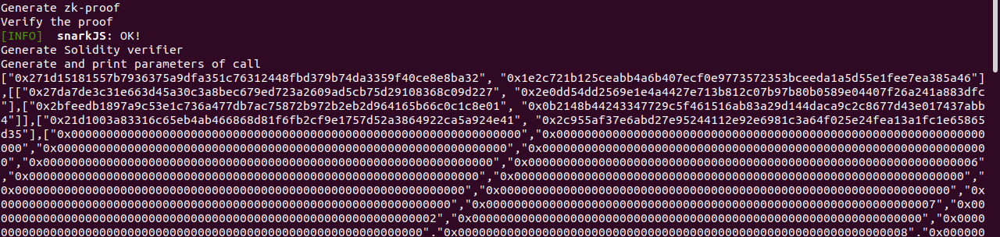
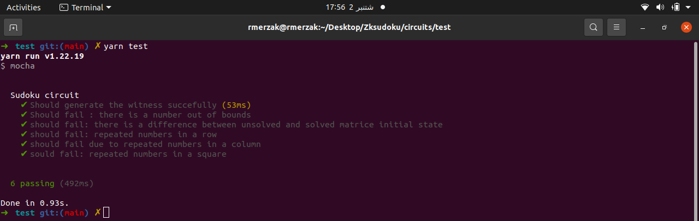
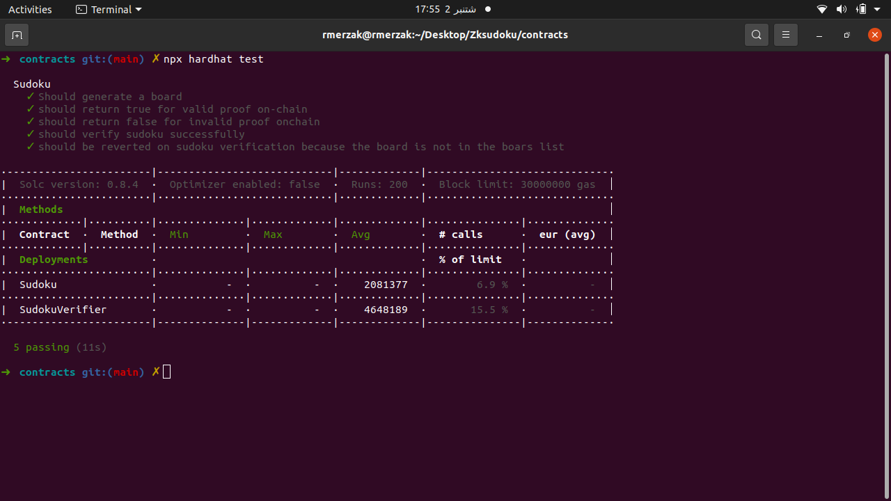
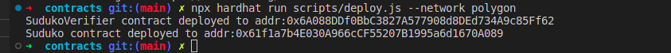
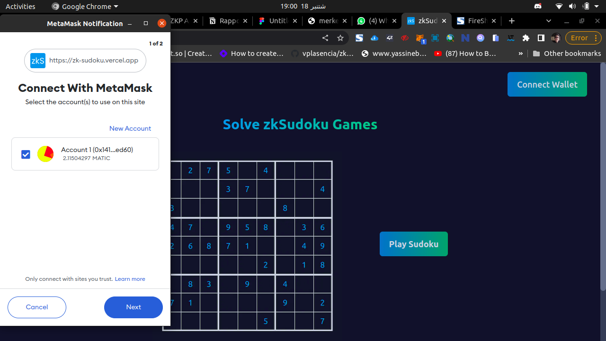
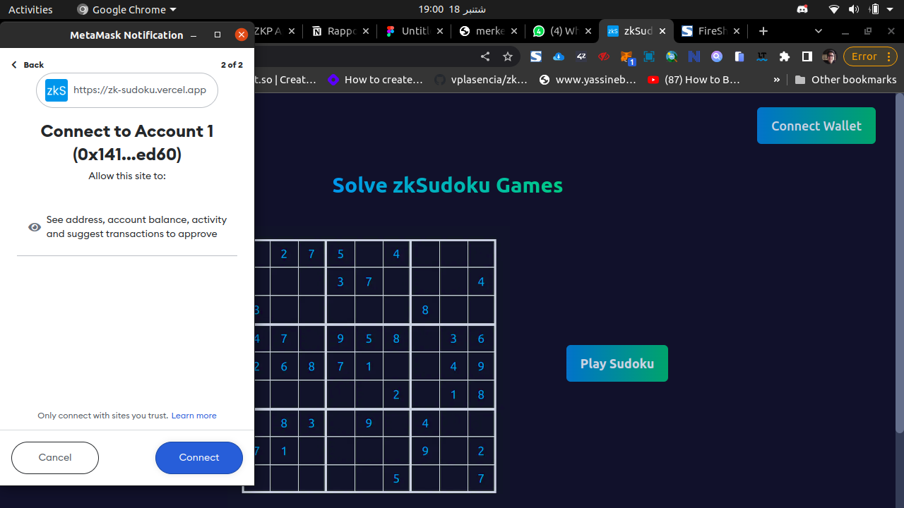

# 


Réalisé par :                |         Encadré par :                                                                                                                                      
MERZAK Rabi             |        M. SUMIT Sharma


unchain.io

# Blockchain

Blockchain is a technology that allows us to do peer-to-peer transaction. you can send funds directly to another person without the interaction of the third party.

## What is a block?

A block in a blockchain record transaction or transactions to organize, monitor, and control information for informed decision-making.
For every new transaction to happen on the blockchain, a record of that transaction is added as a new block to the chain. The new block is added to every node ledger only after applying a consensus algorithm like proof of work to validate the transaction.

### What information are stored in block?

a block consist of a :

1. block header containing metadata
2. transaction stored in the block using Merkel Tree (talk later about it)

the block header contains:

- Version number: track the software or protocol that will allow other computers to read the block correctly.
- Timestamp : when the transaction was recorded.
- 256 bit Cryptographic hash of the previous block : header that links one block with another block in a blockchain.
- Nonce : number only used once. its the number that generate by miners to solve a complex mathematical problem to create a block.
- Merkel root hash

### what is transaction?

a Transaction is a Data structure that contains several elements that represent what activity happens in Ethereum blockchain network. it is the only thing that can update and change the Ethereum state.

Transaction or Transactions are stored in the Block using the Merkel tree hash.

### Transaction explained:

1. the transactions are collects by The network made at around the same time in blocks.
2. Those blocks form a "chain", its an online decentralized record of every transaction ever made in that chain. the network knows that a transaction is valid when it gets formally included in the blockchain.
3. the entire network must agree on the validity of a transaction. Before it gets on the blockchain. cycle life of a transaction **unconfirmed/pending** **confirmed**, or **rejected**
4. the transaction fee goes to miners. hight-powered computers that get paid to validate transactions on the network.
5. Miners prioritize transaction with higher fees. with a low transaction fees you must wait a long time to confirm it also wallets uses dynamic fees it means that it chooses a fee based on how busy the network is. the busier the network, the higher the fee.
6. if the fee doesnt cover the work the miners have to do, the network reject it.
7. in most cases, the fees suggested based on network traffic will cover the transaction, causing them to confirm quickly.

Structure of the transaction:

there is two type of nonce: proof of work nonce and transaction nonce.
transaction nonce : is a sequence number of transactions sent from a given address. its prevents replay-attack on ETH blockchain.

Gas price:
it represent the price of Gas in Gwei. determined by market supply and demand.

Gas limit:
is a limit of amount of ETH the sender os willing to pay for the transaction.

Recipient:
is the destination of Ethereum address. It is either EOA(Externally-Owned Account) or contract address

Value:
the value field represent the amount of eth/wei from the sender to the recipient.

Data :
Data contains messages that can be conceived of as function calls. As Ethereum has smart contract function, a transaction needs to contain messages in order to call/execute functions.

v,r,s:
its the components of ECDSA digital signature of the originating EOA. (important: must work on)

## Signing and Verifying Ethereum Transaction

### Transaction Verification in Block:

in blockchain whenever a transaction occurs between two users, it will be broadcasted among all the nodes in the network. All of them will verify the transaction and add it to their copy of the blockchain.

the question is, how a user can keep track of thousands of transactions occurring per day?

problem:


Amith want to verify that his transaction is a part of the block. Who can help him?

using the Merkel Tree root, which is stored in the block header. He can re-calculate the root hash of the block based on his data, if there is a matching Amith will be sure that his transaction imprinted in the specified block.



In a blockchain, a *Merkle path* or *transaction proof* for a transaction consists of siblings of all the nodes along the branch connecting Merkle root and leaf node representing the transaction.

## Merkle Tree

merkle tree are used in the blockchain , there are ***incredibly valuable**  helping with an easy verification of information without flooding the network with unnecessary data.* 

# What is a tree?

Tree as a data structure:


- Each member of the tree is called a *node.* The lines connecting the nodes are called *edges.*
- The topmost node is called the *root node*. Every operation on the tree begins from the root node.
- *Parent nodes* comprise one or more *child nodes*.
- The bottom nodes of the tree are called *leaf nodes.*
- The process of navigating a tree is called *traversal.*
- A *path* between two nodes consists of the nodes which are visited while moving through the branches that connect those two nodes.

**Merkle Tree:**

exemple:


- Find the hash value of every data item. These hash values will be the leaf nodes of our Merkle Tree.
- Group the leaf nodes into pairs, starting from left to right.
- Create a parent node for each pair. Combine the hash values of the leaf nodes and apply the hash function to the combined value. This will be the label of the parent node.
- *Next* group the parent nodes into pairs and repeat the above step.
- Continue the pairing until we are left with a single node which is the Merkle root or root hash.

 

## **Searching in a Merkle Tree:**

The major use for merkel tree is that it makes the search operation faster and efficient. Example:

suppose that we wanna look if *Hyperledger* is included in the list. 


We can re-calculate the value of root hash from **H(E)** by tracing the path from **H(E) to the root node**


if we see that the re-calculated value of root is equal to the true root hash, it means that Hyperledger is included in the list.

in our example we required 3 additional nodes to calculate the root hash. So the Merkle path for **H(E)**  is **H(F)** , **H(GG)** , **H(ABCD)** 

## Merkel tree and Blockchain:

The transactions within the block are first converted to hash values using the **SHA256** 
algorithm. Merkle tree is constructed on these hash values and the Merkle root is recorded in the root hash field.


for more explanation this is how the representation for a block in blockchain:


### Let’s see now, how the blocks are “*chained*”?

the *previous hash* field in the block header in the binding force and clue for chaining. Blocks store the hash of value of the previous block, thereby acting as a pointer to the the previous block.


if any change are made into block, the hash will also change.and if the hash of the block is changed, the *previous hash value of the following blocks will become invalid, breaking the linkage of blocks.*

# zero knowledge proofs

# introduction:

The high **tranparency** of public distributed ledgers is a desirable feature .However, the need to guarantee privacy has grown in the recent years. Need to find a balance between privacy and transparency.

A solution to achieve this duality: Zero-Knowledge Proofs.

## What is a ZKP ?

a zero knowledge proof (ZKP) is a cryptographic method which allows to  the prover to prove to the verifier that they have the possession of some information and secrets without revealing the information to the verifier.

In Other words, ZKP = The ability to prove honest computation without revealing inputs.

### history:

Zero-Knowledge Proofs (1985) 1985 paper "The Knowledge Complexity of Interactive Proof-Systems" by Shafi Goldwasser, Silvio Micali, and Charles Rackoff
First coined the term zero-knowledge proofs for their interactive protocol

## Example:

[How to Explain Zero-Knowledge Protocols to Your Children](http://pages.cs.wisc.edu/~mkowalcz/628.pdf) in this link the author provide an abstract illustration of how ZKPs work.

we have a cave that contain a magic door . which requires a secret word to open it, to enter this cave you have to options A and B both of the are leading to the magic door.


two persons, Priya (**p**rover) and Varun (**v**erifier) where Priya knows the secret words to open the magic door and Varun does not. Varun is curion about if Priya Knows the secret Words or not.

this picture bellow is devised on two paths to prove that she Knows the secret words without revealing it.


the verifier Varun waits outside the cave but Priya goes inside . Priya takes one of the paths A or B. Varun doesn't Know which path Priya takes. the Varun enters and Shouts the name of the path he want her to use to return, either A or B, chosen at random.


there are two cases:

Case 1 : if (Priya Knows the secret Words) now she can return via the path specified even if it requires her to open he gate with the secret words. 


Case 2: if (Priya *doesn’t* Know the secret Words). in this case she can only return via the path she cane from in. if its the path that Varun chose its oky if not she is lying.

so there is 50% chance that she still can successfully claim that she Knows the secret words, even though she doesn’t.

50% is good enough, so Priya and Varun repeat this exercices. with each iteration the chances for not knowing the secret words and being able claim that she does, decreases.

At this point,Priya has successfully proven that she really does possess the does posses

the knowledge of secret words.

must satisfy three properties:

- Completeness
if the statement is true, an honest verifier will be convinced by an honest prover.
- Soundness
if the statement is false, no cheating prover can convince the honest verifier
- zero-knowledge
if the statement is true, no verifier learns anything other than the fact that the statement is true.

**TYPES OF ZERO-KNOWLEDGE PROOF**

- **INTERCATIVE ZERO-KNOWLEDGE PROOF.**
- **NON-INTERCATIVE ZERO-KNOWLEDGE PROOF.**

### exemple of a data exchange with ZKP:


## ****Applications****

Notable examples of ZKPs in the wild on Ethereum: 

### ****Private Blockchains****

ZKPs is used to make and guarantee that a transaction are valid despite the fact that information about the sender, the recipient, and other transaction details remain hidden.

### ****Authentication Systems****

ZKPs can used to make good authentication System where there is a passwordless logins. using Zero-knowledge password proof.

### ****Secure Transactions****

with ethreum we can send money to another person contingent on them producing the preimage of a SHA256 hash, with the condition that should they fail to produce the preimage, you get your money back. ZKPs can be used to enforce that the preimage of the hash is a key which unlocks some data you want, this becomes a powerful tool for building exotic protocols or performing risky transactions. 

### Gaming

how to create a game on Ethereum (where all the state is public) that requires some hidden data?

### Private Transactions

how to add any privacy layer on top of Ethereum (where all state is public)?

# ZKP APPLICATION

# ****What are zk-SNARKs?****

zk-SNARKs — highlights of the evolution of the most popular ZKP

**2011** first paper to coin the term zk-SNARKSs (Succinct Non-interactive arguments ****of Knowledge)

**2013** first to make zk-SNARKSs applicable for general computingThe “Pinocchio” 

paper 

simply zk-SNARKS is a type of proof — a zero-knowledge proof.

**the meaning of zk-SNARK:**

if full zk-snark stands for Zero-Knowledge Succinct Non-Interactive Argument of Knowledge.

- **Zero-Knowledge:** no information beyond what is needed has to be shared
- **Succinct:** simple to check with only a little bit of data
- **Non-interactive:** no need for any back-and-forth; one request is all that’s needed
- **Argument:** a proof that is *sound*, meaning a computer knows that it works
- **Knowledge:** the information is known, and that can be proven

## Zk-SNARKSs

SNARK construction flow (at least for PHGR13 / Groth16 SNARKS)

1. Computation
2. Arithmetic Circuit
3. RICS (rank 1 constraint system)
4. QAP (quadratic arithmetic program)
5. SNARK

(TODO task 👆)

## Why is Groth16 so great?

ZKPs are typically graded on:

1. provertime

2. proof size

3. verification time

zk-SNARKSs (Groth16) have:

1. a (fairly) efficient **prover time**

2. constant **proof size** (192 bytes)

3. constant (and fast!) **verification time**

## Comparison(SNARKs, STARKs and Bulletproofs):

Comparison: ( SNARKs, STARKs and Bulletproofs) =⇒ there are zero knowledge proof system to provide privacy for the blockchain technology.


SNARKs requires a trusted setup. but the teo other not


table explanation:

SNARKS proof size is **very small** 288 bytes but it teaks 2.3 s for the computation process  to prove some statement and it takes 10 ms for the verifier time.

STARKS proof size is **very Big**   45 KB to 200KB  but it teaks 1.6 s for the computation process  to prove some statement and it takes 16 ms for the verifier time.

Bulletproofs proof size is **Medium**   about 1.3KB  but it teaks very **long time** 30s for the computation process  to prove some statement and also for the verifier time.

### more data comparaison:


According to Zooko Wilcox's (Zcash) [keynote](https://slideslive.com/38911617/privacy-for-everyone) from Devcon4:


**conclution:**

Starks are better than Snarks: they required weaker crypto assumption, dont require trusted setup and post-quantum resistant. but the problem that they have a huge proof.

if we choose between Snark proof in the order of hundreds of bytes and Stark proof in the hundreds of kilobytes. this  is a killer factor for our applications.

the time to verify is larger in Starks than Snarks. in the former, it Grows in time O(ploy log n).               — n = number of gates—, but for Snarks it is linear in the input size, its just a small constant, especially in complex circuits.

(….)

### similar apps using ZKPs :


Zcash:  has optional **shielded transactions** that use zk-SNARKs Has a ceremony for the trusted setup per circuit upgrade


Use **recursive SNARKs** to give a merkle root of latest global state with a proof New nodes do not have to sync from the genesis block to build up their in-memory global state.


Batching transactions off-chain for a decentralized exchange (DEX)

## Open Source Project:

### SNARKs:

[Zokrates](https://github.com/JacobEberhardt/ZoKrates) a great SNARK domain specific language (DSL) for generating proofs and validating them on Ethereum

[Bellman](https://github.com/zkcrypto/bellman) Rust implementation

[Snarky](https://github.com/o1-labs/snarky) OCaml implementation (DSL)

[LIbsnark](https://github.com/scipr-lab/libsnark) C++

Iden3’s [Circum](https://github.com/iden3/circom) (DSL) & [SnarkJS](https://github.com/iden3/snarkjs) Javascript Implementation

Republic Protocol’s [zksnark-rs](https://github.com/republicprotocol/zksnark-rs) (DSL) Rust implementation

[DIZK](https://github.com/scipr-lab/dizk) Java Distributed system

[Go-SNARK](https://github.com/arnaucube/go-snark) zkSNARK library implementation in Go

### STARKs

[Go implementation](https://github.com/wolkdb/deepblockchains/tree/master/stark) (with pretty useful links!)

[C++ implementation](https://github.com/elibensasson/libSTARK)

### Bulletproofs

[Ristretto](https://github.com/dalek-cryptography/bulletproofs) Rust implementation with GREAT [documentation](https://doc-internal.dalek.rs/ristretto_bulletproofs/notes/index.html) (maintained by Chain/Interstellar)

[Benedikt's Bunz Java implementation](https://github.com/bbuenz/BulletProofLib)

## Some Math:

**Diffie Hellman (1976)**

- First published method of public-key cryptography
- Secret sharing of an encryption key


**RSA (1977)**

- One of the first public key cryptosystems
- Uses Diffie-Hellman
- Digital Signatures


### Fiat-Shamir (1986)

- Interactive proof of knowledge
- “Grandfather” of ZKPs
- Allows one to prove information about a number, without revealing the number

exemple:

*g is a number (called generator) everyone knows*

Alice wants to prove that she knows **x**, such that ***$y = g^x$***

She picks a random v, and sends *t *****such that $***t = g^v***$

Bob pics a random **c**, and sends that to Alice

Alice sends back *r = v  - cx*

Bob checks $***t = g^ry^c***$

Since *g^r*y^c = g^(v-cx) *  g^(xc) = g^v = t*

Bob knows that Alice knows the “preimage” x

**Elliptic Curve Cryptography**

elliptic curve is a type of [cubic curve](https://mathworld.wolfram.com/CubicCurve.html) whose solutions are confined to a region of space that is topologically equivalent to a [torus](https://mathworld.wolfram.com/Torus.html).

But for our aims, an elliptic curve will simply be **the set of points described by the equation**:

                                                     $y^2 = x^3 + ax +b$


Different shapes for different elliptic curves ((b=1, a varying from 2 to -3).

Abelian Group Properties for a set of G


****The group law for elliptic curves:****

We can define a group over elliptic curves. Specifically:

- the elements of the group are the points of an elliptic curve;
- the **identity element** is the point at infinity 0;
- the **inverse** of a point  is the one symmetric about the x-axis;
- **addition** is given by the following rule: **given three aligned, non-zero points P, Q and R, their sum is P + Q + R = 0**.


# ZKP APPLICATION

## what are ZKsnarks ?

ZKsnarks: **Zero Knowledge Succinct Non-interactive Arguments of Knowledge** are a particular type of zero-knowledge proofs. Which the prover can generate the proof without interaction with the verifier.

in other way it's a fast way for computational zero knowledge proofs that allow us to demonstrate things without giving any information 

(the most preferable NIZK are **zk-SNARK**)

they help to improve privacy guarantees, but on the other, their small proof size has been used in scalability solutions. 

exemple:

1. Bob wants to demonstrate something to Alex that he have the answer for some problem
2. Bob will receive from the Trusted execution environment (TEE : is an environment in which the executed code and data that is accessed are physically isolated and confidential protected so that no one without integrity can access the data or change the code or its behavior)  a value S and a CRS.
3. if Bob knows the solution, he will be able to demonstrate the divisibility between several polynomial functions.
4. if he has the correct . The output realized by the verifier is 1, else 0

so we can summarize the Snark construction process:

- every mathematical problem can be summarized on a circuit ( using Circom language)
- The circuit will be transformed to a Quadratic Arithmetic Program(QAP) by extracting its polynomic functions Wich at the same time , can be seen as a Computation Model.

we can visual the process and math involved:


so we can conclude that SNARKS are complex mathematical constructions. B**uilding circuits is the hard thing. C**ircuits are so difficult for developers to know how build them specially with **c++.**

that why Circom appears as a solution making our life much easier by providing an easy **CLI** and a great compiler **jaz** to transform our circuits written on circom to QAP.

## What is circom?

circom is **a compiler written in Rust for compiling circuits written in the circom language**. The compiler outputs the representation of the circuit as constraints and everything needed to compute different ZK proofs.

circom allows the programmer to design arithmetic circuits at low level (like done for electronic circuits)

in Circom all constraints have to be explicitly added by the programmer

in circom, actual circuits are called components, A component is created by initiation of a template, which is a parameterized general description of a circuit.

The circomlib contains the implementation of useful circuits that can be used as primitive templates:

-Binary transformers and operations

- Comparators

- Hash functions: mimc, pedersen, sha256.

- Elliptic cyrves: babyjubjub (twisted Edwards), Montgomery

- Sparse Merkle Trees
it shows the power of the language and how to encode complex computations as quadratic constraints.

# **Why do we need circuits?**

zk-snarks can’t be applied to any computational problem directly. The problem first needs to be converted into the right form. The first step is to convert it into an algebraic circuit.


### ****Arithmetic Circuits:****

the implementation of the zero-Knowledge program is different from other programs. the program need to be converted into circuits. to be honest the program is converted into a polynomial problem then to circuits.

Circom turn the logic of our problem into circuits. the best way is to use circomlib  where you can find all the require functions (hashing or signature).

With `circom`, you design your own circuits with your own constraints, and the compiler outputs the R1CS representation that you will need for your zero-knowledge proof.

# learning by doing (**[Zksudoku](https://github.com/rmerzak/Zksudoku)**):

The goal of this implementation is to understand how zksnarks works and to build a Zero Knowledge Decentralized Application (Zk-Dapp) and to explain the flow of zk daap.

we will use Circom (for circuits), Solidity (for smart contracts).

to build this zk-daap (backend) we will use **Groth16**.


### what is Groth16 ?

 its one of the famous zkSNARKS proving schemes , so fast for proving and for verification.

****the Groth16 Algorithm:****

in a Groth16 scheme, a prover needs to prove that he knows a secret called witness $(a₁,a₂,..)$ 

which satisfies the following equation with a public statement .


*uᵢ(X), vᵢ(X), wᵢ(X), h(X), t(X) in the above equation is related to the* the specific problem to be proved and is not related to the secret witness **held by the prover and the public s*tatement*

****The Security of Groth16:****

Groth16 has a qualitative leap in efficiency compared to previous proof algorithms (such as PGHR13, GM17).

**let's start:**

First we must create a Circuits folder where we will have all the other folders and files related to our work. to tree of the folder look like:

 ├ ── circuits
  │   ├ ── package.json
  │   ├ ── sudoku
  │    │   ├ ── [compile.sh](http://compile.sh/)
  │   │    ├ ── [executeGroth16.sh](http://executegroth16.sh/)
  │   │    ├ ── [generateWitness.sh](http://generatewitness.sh/)
  │   │   └── sudoku.circom
  │  └── yarn.lock

### Circom Basics:

circom symbols:

1. “<- -” : This is used when defining witness value.
2. “ = = =”: This is used to imply an assert statement for the values in the left and right.
3. “< = =” : This is used to apply both “<- -” and “ = = =”.

signal:

The arithmetic circuits built using circom operate on signals, which contain field elements in Z/pZ. Signals can be named with an identifier or can be stored in arrays and declared using the keyword signal. Signals can be defined as input or output, and are considered intermediate signals otherwise.

component:

A component defines an arithmetic circuit and, as such, it receives N input signals and produces M output signals and K intermediate signals. Additionally, it can produce a set of constraints.

### sudoku.circom:

```jsx
pragma circom 2.0.0; // specifie the compiler version

//include other circuits from circomlib {comparators.circom} 
include "../node_modules/circomlib/circuits/comparators.circom";

template Sudoku() {
        
        // our circuits accept two (private by default) signals (matrice [9][9]) 
    signal input unsolved[9][9];
    signal input solved[9][9];

    component getone[9][9];
    component letnine[9][9];

    for (var i = 0; i < 9 ; i++) {
        for(var j = 0; j < 9 ; j++) {
            letnine[i][j] = LessEqThan(32);
            letnine[i][j].in[0] <== solved[i][j];
            letnine[i][j].in[1] <== 9;

            getone[i][j] = GreaterEqThan(32);
            getone[i][j].in[0] <== solved[i][j];
            getone[i][j].in[1] <== 1;

          i  letnine[i][j].out === getone[i][j].out; 
        }
    }

    component ieBoard[9][9];
    component izBoard[9][9];
    for(var i = 0; i < 9; i++) {
        for (var j = 0; j < 9; j++) {
            ieBoard[i][j] = IsEqual();
            ieBoard[i][j].in[0] <== solved[i][j];
            ieBoard[i][j].in[1] <== unsolved[i][j];

            izBoard[i][j] = IsZero();
            izBoard[i][j].in <== unsolved[i][j];

            ieBoard[i][j].out === 1 - izBoard[i][j].out;
        }
    }

    component ieRow[324];

    var indexRow = 0;
    for (var i = 0; i < 9; i++) {
        for (var j = 0; j < 9 ; j++) {
            for (var k = 0; k < j; k++) {
                ieRow[indexRow] = IsEqual();
                ieRow[indexRow].in[0] <== solved[i][k];
                ieRow[indexRow].in[1] <== solved[i][j];
                ieRow[indexRow].out === 0;
                indexRow++;
            }
        }
    }

    component ieCol[324];
    var indexCol = 0;

    for (var i = 0; i < 9; i++) {
        for (var j = 0; j < 9; j++) {
            for (var k = 0; k < i; k++){
                ieCol[indexCol] = IsEqual();
                ieCol[indexCol].in[0] <== solved[k][j];
                ieCol[indexCol].in[1] <== solved[i][j];
                ieCol[indexCol].out === 0;
                indexCol++;
            }
        }
    }

    component ieSquare[324];

    var indexSquare = 0;

    for (var i = 0; i < 9; i+= 3) {
        for (var j = 0; j < 9; j += 3) {
            for (var k = i; k < i + 3; k++) {
                for (var l = j; l < j + 3; l++) {
                    for (var m = i; m <= k; m++) {
                        for (var n = j; n < l; n++) {
                            ieSquare[indexSquare] = IsEqual();
                            ieSquare[indexSquare].in[0] <== solved[m][n];
                            ieSquare[indexSquare].in[1] <== solved[k][l];
                            ieSquare[indexSquare].out === 0;
                            indexSquare++;
                        }
                    }
                }
            }
        }
    }
}
component main { public [unsolved]} = Sudoku();
```

### first Part:

in this part of code we check if all the numbers of the solved sudoku are ≥ 1 and ≤ 9 for this purpose we use two others components **getone[9][9]** and **letnine[9][9]** where:

letnine[9][9] = LessEqThan(32);

getone[9][9] = GreaterEqThan(32);

```jsx
        component getone[9][9];
    component letnine[9][9];

    for (var i = 0; i < 9 ; i++) {
        for(var j = 0; j < 9 ; j++) {
            letnine[i][j] = LessEqThan(32);
            letnine[i][j].in[0] <== solved[i][j];
            letnine[i][j].in[1] <== 9;

            getone[i][j] = GreaterEqThan(32);
            getone[i][j].in[0] <== solved[i][j];
            getone[i][j].in[1] <== 1;

            letnine[i][j].out === getone[i][j].out; 
        }
    }
```

```jsx
// N is the number of bits the input  have.
template LessThan(n) {
    assert(n <= 252);
    signal input in[2];
    signal output out;

    component n2b = Num2Bits(n+1);

    n2b.in <== in[0]+ (1<<n) - in[1];

    out <== 1-n2b.out[n];
}
template LessEqThan(n) {
    signal input in[2];
    signal output out;

    component lt = LessThan(n);

    lt.in[0] <== in[0];
    lt.in[1] <== in[1]+1;
    lt.out ==> out;
}
```

```jsx
// N is the number of bits the input  have.

template GreaterEqThan(n) {
    signal input in[2];
    signal output out;

    component lt = LessThan(n);

    lt.in[0] <== in[1];
    lt.in[1] <== in[0]+1;
    lt.out ==> out;
}
```

### Second part:

in this part of code we check if unsolved is the initial state of solved

if `unsolved[i][j] != 0` so `unsolved[i][j] == solved[i][j]` 

if  `unsolved[i][j] == 0` so `unsolved[i][j] != solved[i][j]`

```jsx
        component ieBoard[9][9];
    component izBoard[9][9];
    for(var i = 0; i < 9; i++) {
        for (var j = 0; j < 9; j++) {
            ieBoard[i][j] = IsEqual();
            ieBoard[i][j].in[0] <== solved[i][j];
            ieBoard[i][j].in[1] <== unsolved[i][j];

            izBoard[i][j] = IsZero();
            izBoard[i][j].in <== unsolved[i][j];

            ieBoard[i][j].out === 1 - izBoard[i][j].out;
        }
    }
```

```jsx
template IsZero() {
    signal input in;
    signal output out;

    signal inv;

    inv <-- in!=0 ? 1/in : 0;

    out <== -in*inv +1;
    in*out === 0;
}

template IsEqual() {
    signal input in[2];
    signal output out;

    component isz = IsZero();

    in[1] - in[0] ==> isz.in;

    isz.out ==> out;
}
```

### third Part:

in this part of code we check if each row of the solved matrice has all the numbers from 1 to 9

we check for all the elements that they are not equal to the previous elements in the same row.

```jsx
        component ieRow[324];
    var indexRow = 0;
    for (var i = 0; i < 9; i++) {
        for (var j = 0; j < 9 ; j++) {
            for (var k = 0; k < j; k++) {
                ieRow[indexRow] = IsEqual();
                ieRow[indexRow].in[0] <== solved[i][k];
                ieRow[indexRow].in[1] <== solved[i][j];
                ieRow[indexRow].out === 0;
                indexRow++;
            }
        }
    }
```

### Fourth Part:

in this part of code we check if each column of the solved matrice has all the numbers from 1 to 9

we check for all the elements that they are not equal to the previous elements in the same column.

```jsx
        component ieCol[324];
    var indexCol = 0;

    for (var i = 0; i < 9; i++) {
        for (var j = 0; j < 9; j++) {
            for (var k = 0; k < i; k++){
                ieCol[indexCol] = IsEqual();
                ieCol[indexCol].in[0] <== solved[k][j];
                ieCol[indexCol].in[1] <== solved[i][j];
                ieCol[indexCol].out === 0;
                indexCol++;
            }
        }
    }
```

### Final Part:

in this final part we check for each square in solved has all the numbers from 1 to 9

for each element in the square check that the element is not equal to previous elements in the same square.

```jsx
        component ieSquare[324];

    var indexSquare = 0;

    for (var i = 0; i < 9; i+=3) {
       for (var j = 0; j < 9; j+=3) {
            for (var k = i; k < i+3; k++) {
                for (var l = j; l < j+3; l++) {
                    for (var m = i; m <= k; m++) {
                        for (var n = j; n < l; n++){
                            ieSquare[indexSquare] = IsEqual();
                            ieSquare[indexSquare].in[0] <== solved[m][n];
                            ieSquare[indexSquare].in[1] <== solved[k][l];
                            ieSquare[indexSquare].out === 0;
                            indexSquare ++;
                        }
                    }
                }
            }
        }
    }

}
```

### Main Part:

In order to start the execution, an initial component has to be given. By default, the name of this component is “main”, and hence the component main needs to be instantiated with the template Sudoku () .that has a special attribute: the list of public input signals unsolved.

```jsx
component main {public [unsolved]} = Sudoku();
```

## Compilation of the circuit:

### compile:

if we want to compile the circuit we can use the [compile.sh](http://compile.sh) it's a script that can compile our circuits:

```bash
#!/bin/bash

CIRCUIT=sudoku

if ("$1"); then
    CIRCUIT=$1
fi

#Compile the circuit
circom ${CIRCUIT}.circom --r1cs --wasm --sym --c
```

```jsx
--r1cs: it generates the file sudoku.r1cs that contains the R1CS constraint system of the circuit in binary format.
--wasm: it generates the directory sudoku_js that contains the Wasm code (sudoku.wasm) and other files needed to generate the witness.
--sym : it generates the file sudoku.sym , a symbols file required for debugging or for printing the constraint system in an annotated mode.
--c   : it generates the directory sudoku_cpp that contains several files needed to compile the C code to generate the witness.
```

if we run this script :



we create:

sudoku.r1cs: all the equations are here.(used to represent all the wires in the circuit, and so that the can be checked for the proof)

sudoku.sym: all the symbolic information.

sudoku_cpp and sudoku_js (wasm): help us in computing all the values of all the wires of our circuit.

### generate the witness:

Before creating any proof , we need to verify that all the signals of the circuits match the constraints of the circuit.**The set of signals is the witness.**

The ZKPs prove that you know a set of signals that match all the constraints **but without revealing any info about the signals, except public inputs and outputs.** 

we create a file “input.json” that contains 2 matrices one for the solved Sudoku and the other is the unsolved equivalent to it.

```json
{
    "unsolved": [
      [0, 0, 0, 0, 0, 6, 0, 0, 0],
      [0, 0, 7, 2, 0, 0, 8, 0, 0],
      [9, 0, 6, 8, 0, 0, 0, 1, 0],
      [3, 0, 0, 7, 0, 0, 0, 2, 9],
      [0, 0, 0, 0, 0, 0, 0, 0, 0],
      [4, 0, 0, 5, 0, 0, 0, 7, 0],
      [6, 5, 0, 1, 0, 0, 0, 0, 0],
      [8, 0, 1, 0, 5, 0, 3, 0, 0],
      [7, 9, 2, 0, 0, 0, 0, 0, 4]
    ],
    "solved": [
      [1, 8, 4, 3, 7, 6, 2, 9, 5],
      [5, 3, 7, 2, 9, 1, 8, 4, 6],
      [9, 2, 6, 8, 4, 5, 7, 1, 3],
      [3, 6, 5, 7, 1, 8, 4, 2, 9],
      [2, 7, 8, 4, 6, 9, 5, 3, 1],
      [4, 1, 9, 5, 3, 2, 6, 7, 8],
      [6, 5, 3, 1, 2, 4, 9, 8, 7],
      [8, 4, 1, 9, 5, 7, 3, 6, 2],
      [7, 9, 2, 6, 8, 3, 1, 5, 4]
    ]
  }
```

then we run the generateWitness.sh script:

```bash
#!/bin/bash
CIRCUIT=sudoku
if ("$1"); then
    CIRCUIT=$1
fi
#Compile the circuit
circom ${CIRCUIT}.circom --r1cs --wasm --sym --c
#Generate the witness.wtns
node ${CIRCUIT}_js/generate_witness.js ${CIRCUIT}_js/${CIRCUIT}.wasm input.json ${CIRCUIT}_js/witness.wtns
```

we run generate_witness.js using sudoku.wasm taking this input.json and storing all the value of all the wires in this witness.wtns (binary format to store all the values of all wires of our circuits).

we have now a file with extension .wtns that contains all the computed signals and, a file with extension .r1cs that contains the constraints describing the circuit. Both files will be used to create our proof.

## Generate all the necessary files (Proof):

### Generate / Verify Proofs:

after generating the witness, we need to create a trusted setup before running zkp programs.

to create this trusted setup, we need circuits and some random numbers. Once the setup is finished, a proving key and verification key will be generated, one for generating proofs and the other for verification.


Once the proving key and the verification key is created, then we can generate proofs

there are two type of input signals for the circuits, public and private. If we don't want to reveal any input the this input will be private we called it **the witness.** then the prover can generate proofs by the **proving key**, **public input** and the **witness**.


the final step is the verification step where verifiers verify the proof by **public inputs**, **the proof** and **the verification key**.


```bash
#!/bin/bash
# varialble for storing the name of the circuit
CIRCUIT=sudoku
# varialble for storing the number of the ptau file
PTAU=14
if ["$1"]; then
    CIRCUIT=$1
fi
if ["$2"]; then
    CIRCUIT=$2
fi
if [ -f ./ptau/powersOfTau28_hez_final_${PTAU}.ptau]; then
    echo "powerOfTau28_hez_final_${PTAU}.ptau";
else
    echo "Download powerOfTau28_hez_final_${PTAU}.ptau"
    wget -P ./ptau https://hermez.s3-eu-west-1.amazonaws.com/powersOfTau28_hez_final_${PTAU}.ptau
fi
#Compile the circuit
circom ${CIRCUIT}.circom --r1cs --wasm --sym --c
#Generate the witness.wtns
node ${CIRCUIT}_js/generate_witness.js ${CIRCUIT}_js/${CIRCUIT}.wasm input.json ${CIRCUIT}_js/witness.wtns

echo "Generate .zkey file"
#generate the zkey file that contain the proving and verification keys together with all phase 2 contribution
snarkjs groth16 setup ${CIRCUIT}.r1cs ptau/powersOfTau28_hez_final_${PTAU}.ptau ${CIRCUIT}_0000.zkey

echo "Contibute to the 2 phase of the ceremony"
#Contribute to the phase 2 of the ceremony
snarkjs zkey contribute ${CIRCUIT}_0000.zkey ${CIRCUIT}_final.zkey --name="first contribution" -v -e="random"

echo "exporting the verification key"
#export the verification key
snarkjs zkey export verificationkey ${CIRCUIT}_final.zkey verificationkey.json

echo "Generate zk-proof"
#export a zk-proof associated to the circuit and the witness 
snarkjs groth16 prove ${CIRCUIT}_final.zkey ${CIRCUIT}_js/witness.wtns proof.json public.json

echo "Verify the proof"
#Verify the proof
snarkjs groth16 verify verificationkey.json public.json proof.json

echo "Generate Solidity verifier"
snarkjs zkey export solidityverifier ${CIRCUIT}_final.zkey ${CIRCUIT}Verifier.sol

sed -i 's/0.6.11;/0.8.4;/g' ${CIRCUIT}Verifier.sol
sed -i "s/contract Verifier/contract ${CIRCUIT^}Verifier/g" ${CIRCUIT}Verifier.sol
echo "Generate and print parameters of call"
npx snarkjs generatecall | tee parameters.txt
```







As a result of running this script, we create a proof (proof.json) and verification key (sudoku_final.zkey).

```json
{
 "pi_a": [
  "8761418953883921267692715394391300669197033746286785707865339478398084718684",
  "9054862344289480844976012046734214976199071358107125701365664431954881814164",
  "1"
 ],
 "pi_b": [
  [
   "17983822684913478262119655153402400939486260942030688033909726366828523561219",
   "7144632760021262155347494611193850798417304531005672827998245831330774493016"
  ],
  [
   "19540326942028979386793174806572245225756678058853998256708737571309585911151",
   "9792079761949683530361295194217296372748617504693358045264691376863516761939"
  ],
  [
   "1",
   "0"
  ]
 ],
 "pi_c": [
  "822313588099087776606324226692740270877618170212985999117543398959768099445",
  "15509508445053066455881385260565703391056195922511511157996352073085790611809",
  "1"
 ],
 "protocol": "groth16",
 "curve": "bn128"
}
```

also we have generated a solidity verifier to verifier proofs and a parameter.txt file contain our calldata .

here you can find the SudokuVerifier.sol

[Solidity verifier (1)](https://www.notion.so/Solidity-verifier-1-837ef1782f5a423fb83a2ecf962e8588?pvs=21)

## Test Circuits:

we create a circuits.js where we test our Sudoku.circom using circom_tester

```solidity
const {assert} = require("chai");

const wasm_tester = require("circom_tester").wasm;

describe("Sudoku circuit", function () {
    let SudokuCircuit;

    before(async function() {
        SudokuCircuit = await wasm_tester("sudoku/sudoku.circom");
    });
    it ("Should generate the witness succefully", async function () {
        let input = {
            unsolved: [
                [0, 0, 0, 0, 0, 6, 0, 0, 0],
                [0, 0, 7, 2, 0, 0, 8, 0, 0],
                [9, 0, 6, 8, 0, 0, 0, 1, 0],
                [3, 0, 0, 7, 0, 0, 0, 2, 9],
                [0, 0, 0, 0, 0, 0, 0, 0, 0],
                [4, 0, 0, 5, 0, 0, 0, 7, 0],
                [6, 5, 0, 1, 0, 0, 0, 0, 0],
                [8, 0, 1, 0, 5, 0, 3, 0, 0],
                [7, 9, 2, 0, 0, 0, 0, 0, 4],
              ],
              solved: [
                [1, 8, 4, 3, 7, 6, 2, 9, 5],
                [5, 3, 7, 2, 9, 1, 8, 4, 6],
                [9, 2, 6, 8, 4, 5, 7, 1, 3],
                [3, 6, 5, 7, 1, 8, 4, 2, 9],
                [2, 7, 8, 4, 6, 9, 5, 3, 1],
                [4, 1, 9, 5, 3, 2, 6, 7, 8],
                [6, 5, 3, 1, 2, 4, 9, 8, 7],
                [8, 4, 1, 9, 5, 7, 3, 6, 2],
                [7, 9, 2, 6, 8, 3, 1, 5, 4],
              ],
        };
        const witness = await SudokuCircuit.calculateWitness(input);
        await SudokuCircuit.assertOut(witness, {});
    });
    it("Should fail : there is a number out of bounds", async function() {
        let input = {
            unsolved: [
              [0, 0, 0, 0, 0, 6, 0, 0, 0],
              [0, 0, 7, 2, 0, 0, 8, 0, 0],
              [9, 0, 6, 8, 0, 0, 0, 1, 0],
              [3, 0, 0, 7, 0, 0, 0, 2, 9],
              [0, 0, 0, 0, 0, 0, 0, 0, 0],
              [4, 0, 0, 5, 0, 0, 0, 7, 0],
              [6, 5, 0, 1, 0, 0, 0, 0, 0],
              [8, 0, 1, 0, 5, 0, 3, 0, 0],
              [7, 9, 2, 0, 0, 0, 0, 0, 4],
            ],
            solved: [
              [1, 8, 4, 3, 7, 6, 2, 9, 10],
              [5, 3, 7, 2, 9, 1, 8, 4, 6],
              [9, 2, 6, 8, 4, 5, 7, 1, 3],
              [3, 6, 5, 7, 1, 8, 4, 2, 9],
              [2, 7, 8, 4, 6, 9, 5, 3, 1],
              [4, 1, 9, 5, 3, 2, 6, 7, 8],
              [6, 5, 3, 1, 2, 4, 9, 8, 7],
              [8, 4, 1, 9, 5, 7, 3, 6, 2],
              [7, 9, 2, 6, 8, 3, 1, 5, 4],
            ],
        };
        try {
            await SudokuCircuit.calculateWitness(input);
        } catch (err) {
            assert(err.message.includes("Assert Failed"));
        }
    });
    it("should fail: there is a difference between unsolved and solved matrice initial state", async function() {
        let input = {
            unsolved: [
              [0, 0, 0, 0, 0, 6, 0, 0, 0],
              [0, 0, 7, 2, 0, 0, 8, 0, 0],
              [9, 0, 6, 8, 0, 0, 0, 1, 0],
              [3, 0, 0, 7, 0, 0, 0, 2, 9],
              [0, 0, 0, 0, 0, 0, 0, 0, 0],
              [4, 0, 0, 5, 0, 0, 0, 7, 0],
              [6, 5, 0, 1, 0, 0, 0, 0, 0],
              [8, 0, 1, 0, 5, 0, 3, 0, 0],
              [7, 9, 2, 0, 0, 0, 0, 0, 4],
            ],
            solved: [
              [1, 2, 7, 5, 8, 4, 6, 9, 3],
              [8, 5, 6, 3, 7, 9, 1, 2, 4],
              [3, 4, 9, 6, 2, 1, 8, 7, 5],
              [4, 7, 1, 9, 5, 8, 2, 3, 6],
              [2, 6, 8, 7, 1, 3, 5, 4, 9],
              [9, 3, 5, 4, 6, 2, 7, 1, 8],
              [5, 8, 3, 2, 9, 7, 4, 6, 1],
              [7, 1, 4, 8, 3, 6, 9, 5, 2],
              [6, 9, 2, 1, 4, 5, 3, 8, 7],
            ],
          };
          try {
            await SudokuCircuit.calculateWitness(input);
          } catch (err) {
            assert(err.message.includes("Assert Failed"));
          }
    });
    it("should fail: repeated numbers in a row", async function() {
        let input = {
            unsolved: [
              [0, 0, 0, 0, 0, 6, 0, 0, 0],
              [0, 0, 7, 2, 0, 0, 8, 0, 0],
              [9, 0, 6, 8, 0, 0, 0, 1, 0],
              [3, 0, 0, 7, 0, 0, 0, 2, 9],
              [0, 0, 0, 0, 0, 0, 0, 0, 0],
              [4, 0, 0, 5, 0, 0, 0, 7, 0],
              [6, 5, 0, 1, 0, 0, 0, 0, 0],
              [8, 0, 1, 0, 5, 0, 3, 0, 0],
              [7, 9, 2, 0, 0, 0, 0, 0, 4],
            ],
            solved: [
              [1, 8, 4, 3, 7, 6, 2, 9, 1],
              [5, 3, 7, 2, 9, 1, 8, 4, 6],
              [9, 2, 6, 8, 4, 5, 7, 1, 3],
              [3, 6, 5, 7, 1, 8, 4, 2, 9],
              [2, 7, 8, 4, 6, 9, 5, 3, 1],
              [4, 1, 9, 5, 3, 2, 6, 7, 8],
              [6, 5, 3, 1, 2, 4, 9, 8, 7],
              [8, 4, 1, 9, 5, 7, 3, 6, 2],
              [7, 9, 2, 6, 8, 3, 1, 5, 4],
            ],
          };
          try {
            await SudokuCircuit.calculateWitness(input);
          } catch(err) {
            assert(err.message.includes("Assert Failed"));
          }
    });
    it ("should fail due to repeated numbers in a column",async function() {
        let input = {
            unsolved: [
              [0, 0, 0, 0, 0, 0, 0, 0, 0],
              [0, 0, 0, 0, 0, 0, 0, 0, 0],
              [0, 0, 0, 0, 0, 0, 0, 0, 0],
              [0, 0, 0, 0, 0, 0, 0, 0, 0],
              [0, 0, 0, 0, 0, 0, 0, 0, 0],
              [0, 0, 0, 0, 0, 0, 0, 0, 0],
              [0, 0, 0, 0, 0, 0, 0, 0, 0],
              [0, 0, 0, 0, 0, 0, 0, 0, 0],
              [0, 0, 0, 0, 0, 0, 0, 0, 0],
            ],
            solved: [
              [1, 8, 4, 3, 7, 6, 2, 9, 5],
              [5, 3, 7, 2, 9, 1, 8, 4, 6],
              [9, 2, 6, 8, 4, 5, 7, 1, 3],
              [3, 6, 5, 7, 1, 8, 4, 2, 9],
              [2, 7, 8, 4, 6, 9, 5, 3, 1],
              [7, 1, 9, 5, 3, 2, 6, 7, 8],
              [6, 5, 3, 1, 2, 4, 9, 8, 7],
              [8, 4, 1, 9, 5, 7, 3, 6, 2],
              [4, 9, 2, 6, 8, 3, 1, 5, 7],
            ],
          };
          try {
            await SudokuCircuit.calculateWitness(input);
        } catch (err) {
            assert(err.message.includes("Assert Failed"));
        }
    });
    it ("sould fail: repeated numbers in a square", async function () {
        let input = {
            unsolved: [
              [0, 0, 0, 0, 0, 0, 0, 0, 0],
              [0, 0, 0, 0, 0, 0, 0, 0, 0],
              [0, 0, 0, 0, 0, 0, 0, 0, 0],
              [0, 0, 0, 0, 0, 0, 0, 0, 0],
              [0, 0, 0, 0, 0, 0, 0, 0, 0],
              [0, 0, 0, 0, 0, 0, 0, 0, 0],
              [0, 0, 0, 0, 0, 0, 0, 0, 0],
              [0, 0, 0, 0, 0, 0, 0, 0, 0],
              [0, 0, 0, 0, 0, 0, 0, 0, 0],
            ],
            solved: [
              [1, 8, 4, 3, 7, 6, 2, 9, 5],
              [5, 3, 7, 2, 9, 1, 8, 4, 6],
              [9, 2, 1, 8, 4, 5, 7, 6, 3],
              [3, 6, 5, 7, 1, 8, 4, 2, 9],
              [2, 7, 8, 4, 6, 9, 5, 3, 1],
              [4, 1, 9, 5, 3, 2, 6, 7, 8],
              [6, 5, 3, 1, 2, 4, 9, 8, 7],
              [8, 4, 6, 9, 5, 7, 3, 1, 2],
              [7, 9, 2, 6, 8, 3, 1, 5, 4],
            ],
        };
        try {
            await SudokuCircuit.calculateWitness(input);
        } catch (err) {
            assert(err.message.includes("Assert Failed"));
        }
    });
});
```



 

## Smart Contracts:

to work with smart contract we gonna use hardhat library and deploy it on the Polygon test network using Alchemy platform.

we create our smart contract Sudoku.sol :

```solidity
// SPDX-License-Identifier: unchain

pragma solidity ^0.8.4;

interface IVerifier {
    function verifyProof (uint256[2] memory a,
                            uint256[2][2] memory b,
                            uint256[2] memory c,
                            uint256[81] memory input
                            ) external view returns (bool);
}

contract Sudoku {
    address verifierAddr;
    uint8[9][9][3] sudokuBoardList = [
        [
            [1, 2, 7, 5, 8, 4, 6, 9, 3],
            [8, 5, 6, 3, 7, 9, 1, 2, 4],
            [3, 4, 9, 6, 2, 1, 8, 7, 5],
            [4, 7, 1, 9, 5, 8, 2, 3, 6],
            [2, 6, 8, 7, 1, 3, 5, 4, 9],
            [9, 3, 5, 4, 6, 2, 7, 1, 8],
            [5, 8, 3, 2, 9, 7, 4, 6, 1],
            [7, 1, 4, 8, 3, 6, 9, 5, 2],
            [6, 9, 2, 1, 4, 5, 3, 0, 7]
        ],
        [
            [0, 2, 7, 5, 0, 4, 0, 0, 0],
            [0, 0, 0, 3, 7, 0, 0, 0, 4],
            [3, 0, 0, 0, 0, 0, 8, 0, 0],
            [4, 7, 0, 9, 5, 8, 0, 3, 6],
            [2, 6, 8, 7, 1, 0, 0, 4, 9],
            [0, 0, 0, 0, 0, 2, 0, 1, 8],
            [0, 8, 3, 0, 9, 0, 4, 0, 0],
            [7, 1, 0, 0, 0, 0, 9, 0, 2],
            [0, 0, 0, 0, 0, 5, 0, 0, 7]
        ],
        [
            [0, 0, 0, 0, 0, 6, 0, 0, 0],
            [0, 0, 7, 2, 0, 0, 8, 0, 0],
            [9, 0, 6, 8, 0, 0, 0, 1, 0],
            [3, 0, 0, 7, 0, 0, 0, 2, 9],
            [0, 0, 0, 0, 0, 0, 0, 0, 0],
            [4, 0, 0, 5, 0, 0, 0, 7, 0],
            [6, 5, 0, 1, 0, 0, 0, 0, 0],
            [8, 0, 1, 0, 5, 0, 3, 0, 0],
            [7, 9, 2, 0, 0, 0, 0, 0, 4]
        ]
    ];

    constructor(address _verifier) {
        verifierAddr = _verifier;
    }
    function verifyProof(uint256[2] memory a, uint256[2][2] memory b, uint256[2] memory c, uint256[81] memory input) public view returns (bool) {
        return IVerifier(verifierAddr).verifyProof(a, b, c, input);
    }
    function verifySudokuBoard(uint256[81] memory board) private view returns (bool) {
        bool isEqual = true;
        uint256 i;
        uint256 j;
        uint256 k;
        for (i = 0; i < sudokuBoardList.length; i++) {
            isEqual = true;
            for (j = 0; j < sudokuBoardList[i].length; ++j) {
                for (k = 0; k < sudokuBoardList[i][j].length; ++k) {
                    if (board[9 * j + k] != sudokuBoardList[i][j][k]) {
                        isEqual = false;
                        break ;
                    }
                }
            }
            if (isEqual == true) {
                return isEqual;
            }
            return isEqual;
        }
    }
    
    function verifySudoku(uint256[2] memory a, uint256[2][2] memory b, uint256[2] memory c, uint256[81] memory input) public view returns (bool){
        require(verifySudokuBoard(input), "This board does nor exist");
        require(verifyProof(a, b, c, input), "Filed proof check");
        return true;
    }

    function pickRandomBoard(string memory stringTime) private view returns (uint8[9][9] memory) {
        uint256 randomPosition = uint256(
            keccak256(abi.encodePacked(block.difficulty, block.timestamp, msg.sender, stringTime)) )% sudokuBoardList.length;
        return sudokuBoardList[randomPosition];
    }

    function generateSudokuBoard(string memory stringTime) public view returns (uint8[9][9] memory){
        return pickRandomBoard(stringTime);
    }
}
```

we can resume our smart contract:


## testing the smart contract:

we going to use snarkjs library to test the generation of the proof.

```solidity
const {expect} = require("chai");
const {ethers} = require ("hardhat");
const { exportCalldataGroth16 } = require("./utils/utils");

describe("Sudoku", function() {
    let SudokuVerifier, sudokuverifier, Sudoku, sudoku;

    before(async function () {
        SudokuVerifier = await ethers.getContractFactory("SudokuVerifier");
        sudokuVerifier = await SudokuVerifier.deploy();
        await sudokuVerifier.deployed();
    
        Sudoku = await ethers.getContractFactory("Sudoku");
        sudoku = await Sudoku.deploy(sudokuVerifier.address);
        await sudoku.deployed();
      });

    it("Should generate a board", async function () {
        let board = await sudoku.generateSudokuBoard(new Date().toString());
        expect(board.length).to.equal(9);
    });
    it("should return true for valid proof on-chain", async function () {
        const unsolved = [
            [1, 2, 7, 5, 8, 4, 6, 9, 3],
            [8, 5, 6, 3, 7, 9, 1, 2, 4],
            [3, 4, 9, 6, 2, 1, 8, 7, 5],
            [4, 7, 1, 9, 5, 8, 2, 3, 6],
            [2, 6, 8, 7, 1, 3, 5, 4, 9],
            [9, 3, 5, 4, 6, 2, 7, 1, 8],
            [5, 8, 3, 2, 9, 7, 4, 6, 1],
            [7, 1, 4, 8, 3, 6, 9, 5, 2],
            [6, 9, 2, 1, 4, 5, 3, 0, 7],
          ];
      
          const solved = [
            [1, 2, 7, 5, 8, 4, 6, 9, 3],
            [8, 5, 6, 3, 7, 9, 1, 2, 4],
            [3, 4, 9, 6, 2, 1, 8, 7, 5],
            [4, 7, 1, 9, 5, 8, 2, 3, 6],
            [2, 6, 8, 7, 1, 3, 5, 4, 9],
            [9, 3, 5, 4, 6, 2, 7, 1, 8],
            [5, 8, 3, 2, 9, 7, 4, 6, 1],
            [7, 1, 4, 8, 3, 6, 9, 5, 2],
            [6, 9, 2, 1, 4, 5, 3, 8, 7],
          ];
      
          const input = {
            unsolved: unsolved,
            solved: solved,
          };

          let dataResult = await exportCalldataGroth16(input, "./zkproof/sudoku.wasm", "./zkproof/sudoku_final.zkey");
          let result = await sudokuVerifier.verifyProof(dataResult.a, dataResult.b, dataResult.c, dataResult.Input);
          expect(result).to.equal(true);
    });
    it ("should return false for invalid proof onchain", async function() {
        let a =[0, 0];
        let b = [
            [0, 0],
            [0, 0]
        ];
        let c = [0, 0];
        let Input = new Array(81).fill(0);
        let dataResult = {a, b, c, Input};

        let result = await sudokuVerifier.verifyProof(dataResult.a, dataResult.b, dataResult.c, dataResult.Input);
        expect(result).to.equal(false);
    });
    it ("should verify sudoku successfully", async function () {
      const unsolved = [
        [1, 2, 7, 5, 8, 4, 6, 9, 3],
        [8, 5, 6, 3, 7, 9, 1, 2, 4],
        [3, 4, 9, 6, 2, 1, 8, 7, 5],
        [4, 7, 1, 9, 5, 8, 2, 3, 6],
        [2, 6, 8, 7, 1, 3, 5, 4, 9],
        [9, 3, 5, 4, 6, 2, 7, 1, 8],
        [5, 8, 3, 2, 9, 7, 4, 6, 1],
        [7, 1, 4, 8, 3, 6, 9, 5, 2],
        [6, 9, 2, 1, 4, 5, 3, 0, 7],
      ];
  
      const solved = [
        [1, 2, 7, 5, 8, 4, 6, 9, 3],
        [8, 5, 6, 3, 7, 9, 1, 2, 4],
        [3, 4, 9, 6, 2, 1, 8, 7, 5],
        [4, 7, 1, 9, 5, 8, 2, 3, 6],
        [2, 6, 8, 7, 1, 3, 5, 4, 9],
        [9, 3, 5, 4, 6, 2, 7, 1, 8],
        [5, 8, 3, 2, 9, 7, 4, 6, 1],
        [7, 1, 4, 8, 3, 6, 9, 5, 2],
        [6, 9, 2, 1, 4, 5, 3, 8, 7],
      ];
      const input = {
        unsolved: unsolved,
        solved: solved,
      }
      let dataResult = await exportCalldataGroth16(input, "./zkproof/sudoku.wasm", "./zkproof/sudoku_final.zkey");
          let result = await sudokuVerifier.verifyProof(dataResult.a, dataResult.b, dataResult.c, dataResult.Input);
          expect(result).to.equal(true);
    });
    it("should be reverted on sudoku verification because the board is not in the boars list", async function() {
      const unsolved = [
        [1, 2, 7, 5, 8, 4, 6, 9, 3],
        [8, 5, 6, 3, 7, 9, 1, 2, 4],
        [3, 4, 9, 6, 2, 1, 8, 7, 5],
        [4, 7, 1, 9, 5, 8, 2, 3, 6],
        [2, 6, 8, 7, 1, 3, 5, 4, 9],
        [9, 3, 5, 4, 6, 2, 7, 1, 8],
        [5, 8, 3, 2, 9, 7, 4, 6, 1],
        [7, 1, 4, 8, 3, 6, 9, 5, 2],
        [6, 9, 2, 1, 4, 5, 3, 8, 0],
      ];
  
      const solved = [
        [1, 2, 7, 5, 8, 4, 6, 9, 3],
        [8, 5, 6, 3, 7, 9, 1, 2, 4],
        [3, 4, 9, 6, 2, 1, 8, 7, 5],
        [4, 7, 1, 9, 5, 8, 2, 3, 6],
        [2, 6, 8, 7, 1, 3, 5, 4, 9],
        [9, 3, 5, 4, 6, 2, 7, 1, 8],
        [5, 8, 3, 2, 9, 7, 4, 6, 1],
        [7, 1, 4, 8, 3, 6, 9, 5, 2],
        [6, 9, 2, 1, 4, 5, 3, 8, 7],
      ];
  
      const input = {
        unsolved: unsolved,
        solved: solved,
      };

      let dataResult = await exportCalldataGroth16(input, "./zkproof/sudoku.wasm", "./zkproof/sudoku_final.zkey");
      await expect(sudoku.verifySudoku(
        dataResult.a,
        dataResult.b,
        dataResult.c,
        dataResult.Input
        )
        ).to.be.reverted;
    });
})
```

the exportCalldataGroth16 function:

```solidity
const {groth16} = require("snarkjs");
async function exportCalldataGroth16(input, wasmPath, zkeyPath) {
    const {proof :_proof, publicSignals: _publicSignals} = await groth16.fullProve(input, wasmPath, zkeyPath);
    const calldata = await groth16.exportSolidityCallData(_proof, _publicSignals);
    const argv = calldata.replace(/["[\]\s]/g,"").split(",").map((x)=>BigInt(x).toString());
    const a = [argv[0], argv[1]];
    const b = [
        [argv[2], argv[3]],
        [argv[4], argv[5]],
    ];
    const c = [argv[6], argv[7]]
    const Input = [];
    for (let i = 8; i < argv.length; i++) {
        Input.push(argv[i]);
    }
    return {a, b, c, Input};
}
module.exports = {
    exportCalldataGroth16,
}
```

hardhat.config.js:

```solidity

require("hardhat-gas-reporter");
require("@nomiclabs/hardhat-ethers");
require("@nomicfoundation/hardhat-chai-matchers")
module.exports = {
  solidity: "0.8.4",
  settings: {
    optimizer: {
      enabled: true,
      runs:200,
    },
  },
};
```

result:



## Deploy smart contracts :

we are going to deploy smart contract on Polygon testnet:

inside the **deploy.js** we add:

```jsx
const main = async () => {
  console.log("deploying process has started");
  SudokuVerifier = await hre.ethers.getContractFactory("SudokuVerifier");
  sudokuVerifier = await SudokuVerifier.deploy();
  await sudokuVerifier.deployed();

  console.log(
    "SudukoVerifier Contract address is : " + sudokuVerifier.address
  );

  Sudoku = await hre.ethers.getContractFactory("Sudoku");
  sudoku = await Sudoku.deploy(sudokuVerifier.address);
  await sudoku.deployed();

  console.log("Suduko address is :" + sudoku.address);
};

const runmain = async () => {
  try {
    await main();
    process.exit(0);
  } catch (err) {
    console.log(err);
    process.exit(1);
  }
};

runmain();
```

hardhat.config.js:

```jsx
require("dotenv").config();
require("hardhat-gas-reporter");
require("@nomiclabs/hardhat-ethers");
require("@nomicfoundation/hardhat-chai-matchers")
require("@nomiclabs/hardhat-waffle");
module.exports = {
  solidity: "0.8.4",
  settings: {
    optimizer: {
      enabled: true,
      runs:200,
    },
  },
  networks: {
    polygon: {
      url: "https://polygon-mumbai.g.alchemy.com/v2/RS00f4HGurL8w59-qMsB7nwdjdh1Ga0H",
      accounts:[process.env.PRIVATE_KEY]
    }
  }
};
```



### Front part

global interface:


let’s connect our Wallet:





# Zk-SNARKs Transactions


if we encode some Zcash consensus rules into Zk-SNARKs themselves. we can code functions that determines the correctness of a transaction, in accordance with consensus rules, this function must return the answer of whether or not that the transaction is valid or not, without disclosing any of the information with which it performed calculations.

Zcash use Zk-SNARKs to prove that the conditions for a valid transaction have been satisfied without revealing any crucial information about the addresses or value involved. the sender of a shielded transaction constructs a proof to show that, with high probability:

- The input values sum to the output values for each transaction.
- The sender proves that they have the private keys of the input, which gives a user the authority to spend.
- The private spending keys of the input are cryptographically linked to a signature that pertains to the entire transaction, in a manner in which a transaction cannot be modified by a party who did not know these private keys.
